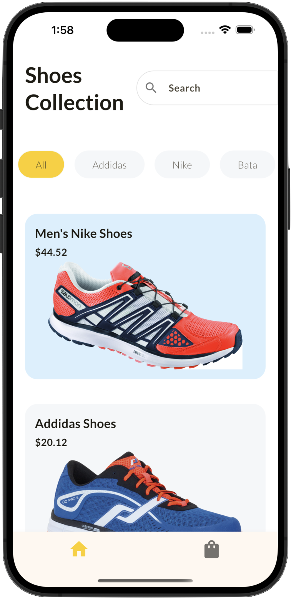
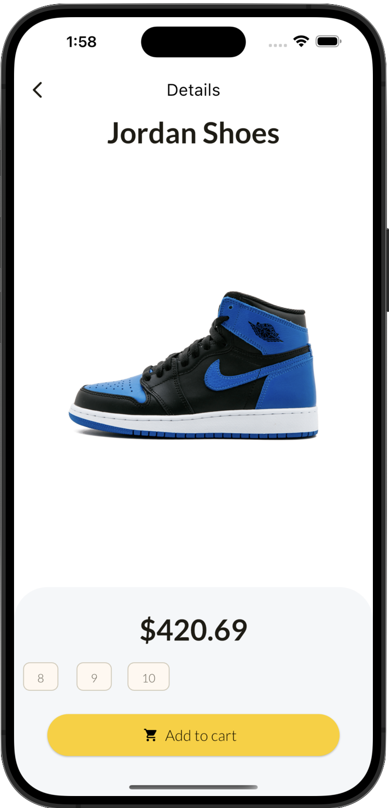
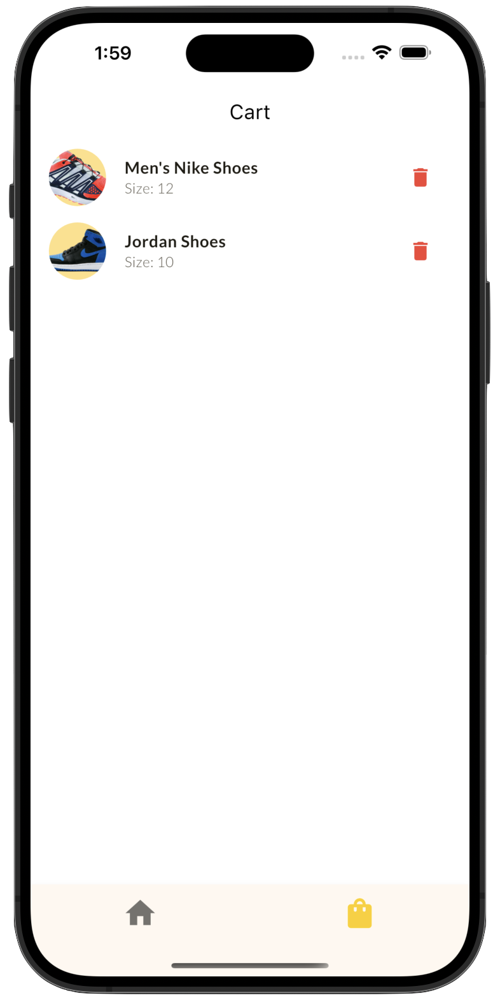

# 🛍️ Shop App

A minimal e-commerce mobile application built with **Flutter**.  
This demo app allows users to **browse products**, **view product details**, **choose sizes**, and **add or remove items from the cart** — all using local state (no backend).

---

## ✨ Features

- 🏷️ **Product Catalog**
  - Browse a list of shoes with price and brand
  - Brand filter tabs (non-functional / for UI only)
  - Search bar (UI only)

- 📝 **Product Details**
  - View large product image, name, price
  - Select shoe size
  - Add product to cart

- 🛒 **Cart**
  - See all items added to cart
  - Remove items from cart
  - Updates immediately with local state

- 🎨 **Modern UI**
  - Clean white theme
  - Rounded cards and smooth layout
  - Responsive design for mobile

---

## 📸 Screenshots

### 🏠 Shop Dashboard

### 👟 Product Page

### 🛍️ Cart

---

## ⚙️ Tech Stack

- Flutter
- Dart
- Provider / setState for state management
- No backend (local-only demo)
